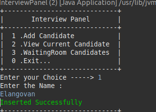
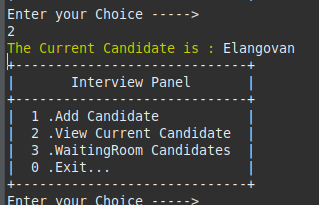
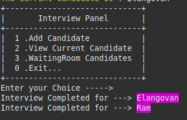
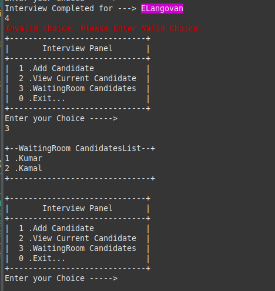

# Interview Panel Documentation

## Table of Contents

1. Introduction
2. System Overview
3. Components
    * InterviewPanel Class
    * AddCandidateView Class
    * AddCandidateViewModel Class
    * RemoveCandidateView Class
    * RemoveCandidateViewModel Class
    * ViewCurrentCandidateView Class
    * ViewCurrentCandidateViewModel Class
    * WaitingRoomCandidatesView Class
    * WaitingRoomCandidatesViewModel Class
    * InterviewPanelRepository Class
4. Usage
5. Conclusion
6. Contributors
7. Class Diagram
8. Preview

##  Introduction

* The Interview Panel Management System is a Java program designed to facilitate the management of candidates in an interview panel. The system provides functionality for adding candidates, viewing current candidates, checking waiting room candidates, and removing candidates after a certain time interval.

## System Overview

* The system follows a __Model-View-ViewModel__ (MVVC)architecture, separating concerns for better maintainability and scalability. Key components include the InterviewPanel class, various view classes (e.g., AddCandidateView, RemoveCandidateView), corresponding model classes (e.g., AddCandidateViewModel, RemoveCandidateViewModel), and the InterviewPanelRepository for data storage.

## Components

### InterviewPanel Class

* The InterviewPanel class serves as the main entry point for the program. It contains the main method and handles user interactions, allowing them to perform actions such as adding candidates, viewing current candidates, and exiting the application.

### AddCandidateView Class

* Responsible for collecting candidate information from the user, validating the input, and invoking the AddCandidateViewModel for further processing. It provides feedback to the user about the success or failure of the operation.

### AddCandidateViewModel Class

* Validates the candidate's information and communicates with the InterviewPanelRepository to insert the candidate. It informs the AddCandidateView about the success or failure of the operation.

### RemoveCandidateView Class

* Uses a Timer to periodically remove candidates from the interview panel after a specified time interval. It communicates with the RemoveCandidateViewModel for candidate removal and provides feedback to the user.

### RemoveCandidateViewModel Class

* Handles the removal of the current candidate from the repository and communicates with the RemoveCandidateView.

### ViewCurrentCandidateView Class

* Displays information about the current candidate in the interview panel.

### ViewCurrentCandidateViewModel Class

* Retrieves the current candidate from the repository and communicates with the ViewCurrentCandidateView.

### WaitingRoomCandidatesView Class

* Displays information about candidates in the waiting room.

### WaitingRoomCandidatesViewModel Class

* Retrieves waiting room candidates from the repository and communicates with the WaitingRoomCandidatesView.

### InterviewPanelRepository Class

* Implements a singleton pattern for managing the storage of candidates. Provides methods for inserting, retrieving, and removing candidates.

## Usage

1. Execute the InterviewPanel class to start the application.

2. Choose from the menu options to perform various actions such as adding candidates, viewing current candidates, and checking waiting room candidates.

3. Candidates are automatically removed from the interview panel after a specified time interval.

## Conclusion

1. The Interview Panel Management System provides a structured approach to managing candidates in an interview panel.

2. The use of __MVVM__ architecture enhances code organization and maintainability.

3. Further improvements and features can be added based on specific project requirements.

## Contributors

> ___M.Elangovan___

## Class Diagram

```
+-----------------------------+           +-------------------------------+
|       InterviewPanel        |           |      AddCandidateView         |
+-----------------------------+           +-------------------------------+
| - sc: Scanner               |           | - addCandidateViewModel:      |
| + main()                    |           |   AddCandidateViewModel       |
| + startInterview()          |           | - green: String               |
| + consoleDetails()          |-----------| - reset: String               |
+-----------------------------+           | - red: String                 |
           |                              | - sc: Scanner                 |
           |                              | + getCandidateInfo()          |
           |                              | + onSuccess()                 |
           |                              | + showError()                 |
           |                              +-------------------------------+
           |                                       |
           | uses                                  | uses
           |                                       |
+-----------------------------+           +-----------------------------------+
|  RemoveCandidateView        |           | ViewCurrentCandidateView          |
+-----------------------------+           +-----------------------------------+
| - removeCandidateViewModel: |           | - viewCurrentCandidateViewModel:  |
|   RemoveCandidateViewModel  |           |   ViewCurrentCandidateViewModel   | 
| - Magenta: String           |           | - yellow: String                  |
| - reset: String             |           | + displayCurrentCandidate()       |
| + start(flag: boolean)      |           +-----------------------------------+
| + run()                     |                    |
| + removeCurrentCandidate()  |                    | 
+-----------------------------+                    |   uses
           |                                       |
           | uses                                  | 
           |                                       |
+-----------------------------+           +-------------------------------------+
| RemoveCandidateViewModel    |           | WaitingRoomCandidatesView           |
+-----------------------------+           +-------------------------------------+
| - removeCandidateView:      |           | - waitingRoomCandidatesViewModel:   |
|   RemoveCandidateView       |           |   WaitingRoomCandidatesViewModel    |
| + removeCurrentCandidate()  |           | + displayWaitingRoomCandidates()    |
+-----------------------------+           +-------------------------------------+
           |                                       |
           | uses                                  |
           |                                       |
+-----------------------------+           +-------------------------------+
|ViewCurrentCandidateViewModel|           |           Candidate           |
+-----------------------------+           +-------------------------------+
| - viewCurrentCandidateView: |           | - name: String                |
|   ViewCurrentCandidateView  |           | + getName()                   |
| + getCurrentCandidate()     |           | + setName(name: String)       |
+-----------------------------+           +-------------------------------+
           |
           | uses
           |
+-------------------------------------------------------+
| InterviewPanelRepository                              |
+-------------------------------------------------------+
| - repository: InterviewPanelRepository                |
| - candidatesList: Queue<Candidate>                    |
| + getInstance()                                       |
| + insertCandidate(candidate: Candidate)               |
| + getCandidatesList(): Queue<Candidate>               |
| + getCurrentCandidate(): Candidate                    |
| + getWaitingRoomCandidatesList(): Queue<Candidate>    |
| + removeCurrentCandidate(): Candidate                 |
+-------------------------------------------------------+


```


## Preview


---

---

---

---